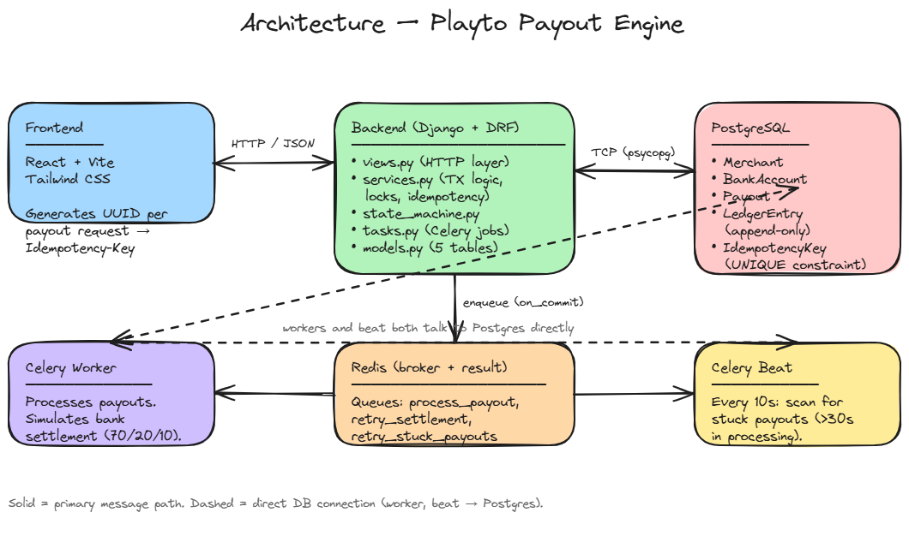
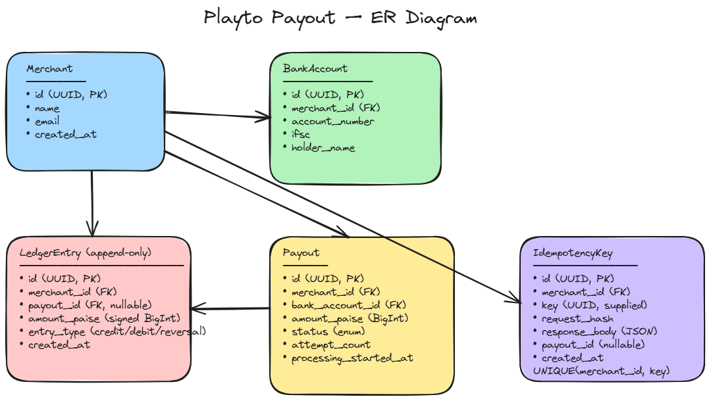
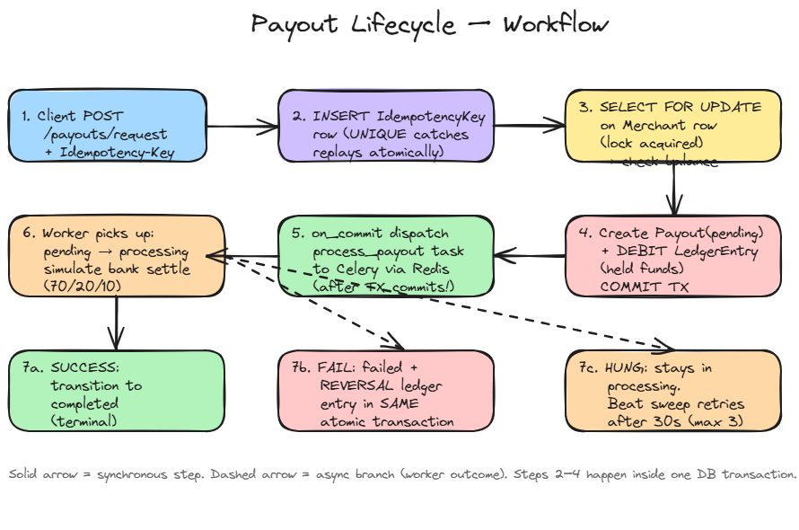

# EXPLAINER

How the Playto Payout Engine actually works, and why it's built the way
it is. Diagrams are inline as Mermaid (renders directly on GitHub) and
also exported as Excalidraw JSON in `/diagrams/`.

---

## 1. Architecture


---

The API never blocks waiting for the bank — it persists the request,
holds the funds, drops a job on Redis, and returns. The worker does the
slow part. That's what lets us model "70% succeed, 20% fail, 10% hang"
without ever blocking an HTTP request.

---

## 2. Data model (ER diagram)


---

**The single design choice that drives everything: a single append-only
LedgerEntry table.** No row is ever updated — failed payouts get a
*reversal* row, not a deleted DEBIT. Audit trail is intact, totals are
trivially recomputable, and the balance equation is one SQL `SUM`.

---

## 3. Payout lifecycle (workflow)


---

Every transition is rejected unless it appears in the table in
`payouts/state_machine.py`. There is no path that says
`completed → pending` because that pair is not in the dictionary.

---

## 4. Answers to the five challenge questions

### Q1. The Ledger — paste your balance calculation query and explain the model

```python
# payouts/services.py
def get_balance_breakdown(merchant_id):
    available = LedgerEntry.objects.filter(
        merchant_id=merchant_id
    ).aggregate(total=Sum('amount_paise'))['total'] or 0

    held_negative = LedgerEntry.objects.filter(
        merchant_id=merchant_id,
        entry_type=LedgerEntry.EntryType.DEBIT,
        payout__status__in=[
            Payout.Status.PENDING,
            Payout.Status.PROCESSING,
        ],
    ).aggregate(total=Sum('amount_paise'))['total'] or 0
    held = abs(held_negative)
    return {
        'available_paise': available,
        'held_paise': held,
        'total_paise': available + held,
    }
```

The SQL Django runs is two `SELECT SUM(amount_paise) ... GROUP BY
merchant_id`. The summing happens on Postgres, never in Python. That
matters: if I had pulled rows into Python and added them up, large
merchants would mean fetching megabytes and risking off-by-one bugs
between query and reality.

**Why credits and debits are signed entries in one table, not two
columns:**

- One source of truth. `available = SUM(amount_paise)` — that's the
  whole calculation. No "credits minus debits minus reversals" formula
  to forget.
- Append-only. A failed payout doesn't update or delete the DEBIT, it
  appends a positive REVERSAL. If you ever need to answer "why does
  this merchant have ₹X right now", you just print the ledger.
- Held vs available is derived. "Held" isn't a column on Merchant — it's
  a query over DEBIT entries whose linked Payout is still in flight.
  No state to keep in sync.

The invariant `SUM(credits) - SUM(absolute debits) + SUM(reversals) =
displayed balance` falls out automatically because all three live as
signed entries in the same table.

---

### Q2. The Lock — what prevents two concurrent payouts from overdrawing?

```python
# payouts/services.py — inside create_payout()
with transaction.atomic():
    merchant = (
        Merchant.objects
        .select_for_update()       # <-- the critical line
        .get(id=merchant_id)
    )

    balance = get_balance_breakdown(merchant_id)
    if amount_paise > balance['available_paise']:
        # reject with 422 insufficient_balance
        ...

    payout = Payout.objects.create(...)
    LedgerEntry.objects.create(
        merchant=merchant,
        amount_paise=-amount_paise,
        entry_type=LedgerEntry.EntryType.DEBIT,
        payout=payout,
        ...
    )
```

The DB primitive is `SELECT ... FOR UPDATE` — a row-level write lock on
the merchant row that lasts until the transaction commits or rolls back.

Walk-through with two threads, ₹100 balance, both requesting ₹60:

1. Thread A enters the transaction, locks merchant row.
2. Thread B enters its transaction. Its `SELECT FOR UPDATE` **blocks**
   inside Postgres — it does not return until A commits.
3. A reads the ledger sum (₹100), checks ₹100 ≥ ₹60, inserts a DEBIT of
   −₹60, commits.
4. B's `SELECT FOR UPDATE` finally returns. B reads the ledger sum
   *now*: ₹100 − ₹60 = ₹40. B checks ₹40 ≥ ₹60 → false → returns 422
   `insufficient_balance`.

Why the lock is on `Merchant`, not on `LedgerEntry`: there is nothing
in `LedgerEntry` to lock — we are about to *create* a row, not update
one. The merchant row is the natural serialisation point because every
balance question is "what's this merchant's balance". Locking
Merchant once per request also keeps the lock surface tiny.

A common mistake AI tools made for me here was suggesting an
application-level lock (e.g. `threading.Lock`, or a Redis
`SETNX` lock). Those would work for a single Python process but break
the moment you run two Gunicorn workers — the lock lives in the wrong
place. `SELECT FOR UPDATE` lives in the database, where the data is.

---

### Q3. Idempotency — how does the system recognise a key it's seen, and what happens if the first request is in flight?

The schema:

```python
class IdempotencyKey(models.Model):
    merchant = models.ForeignKey(Merchant, on_delete=models.CASCADE)
    key = models.CharField(max_length=100)
    request_hash = models.CharField(max_length=64)
    status = models.CharField(...)        # in_flight | completed
    response_status_code = models.IntegerField(null=True)
    response_body = models.JSONField(null=True)

    class Meta:
        constraints = [
            models.UniqueConstraint(
                fields=['merchant', 'key'],
                name='uniq_merchant_idempotency_key',
            ),
        ]
```

Detection logic in `services.create_payout`:

```python
try:
    idem = IdempotencyKey.objects.create(
        merchant_id=merchant_id, key=idempotency_key,
        request_hash=request_hash,
        status=IdempotencyKey.Status.IN_FLIGHT,
    )
except IntegrityError:
    existing = IdempotencyKey.objects.get(
        merchant_id=merchant_id, key=idempotency_key,
    )
    if existing.request_hash != request_hash:
        raise IdempotencyConflict(...)        # 409: same key, different body
    if existing.status == IdempotencyKey.Status.IN_FLIGHT:
        raise IdempotencyInFlight(...)        # 409 + Retry-After: 1
    # status == completed → return the stored response verbatim
    return {
        'replayed': True,
        'status_code': existing.response_status_code,
        'body': existing.response_body,
    }
```

**The trick is the unique constraint.** I don't `SELECT` first to check
if the key exists — that's a TOCTOU race. I `INSERT`, and let Postgres
tell me whether the key was new. The unique index on `(merchant_id,
key)` makes the second concurrent INSERT fail with `IntegrityError`,
atomically.

**What happens if the first request is in flight when the second arrives:**

- The first request inserted the row with `status=in_flight` but hasn't
  written `response_body` yet (it's still mid-transaction).
- The second request hits the unique constraint, falls into the
  `except`, reads the existing row, sees `status=in_flight`, and
  returns **409 Conflict** with a `Retry-After: 1` header. The client
  retries in a moment, and by then the first request has either
  completed (and stored its response) or been rolled back (in which
  case I delete the idempotency row in the exception path so the retry
  can proceed cleanly).

That choice — 409 instead of blocking — is deliberate: holding an HTTP
connection open while another worker finishes is how you turn a flaky
client into a stuck process.

**Keys are scoped per merchant** (the unique constraint includes
`merchant_id`), so two different merchants happening to pick the same
UUID never collide.

**Keys expire after 24 hours** via the periodic
`cleanup_expired_idempotency_keys` task in `payouts/tasks.py`.

---

### Q4. The State Machine — where is "failed → completed" blocked?

The whole table is in one place, `payouts/state_machine.py`:

```python
ALLOWED_TRANSITIONS = {
    Payout.Status.PENDING:    {Payout.Status.PROCESSING, Payout.Status.FAILED},
    Payout.Status.PROCESSING: {Payout.Status.COMPLETED,  Payout.Status.FAILED},
    Payout.Status.COMPLETED:  set(),   # terminal
    Payout.Status.FAILED:     set(),   # terminal
}

def transition_payout(payout_id, new_status, failure_reason=None):
    with transaction.atomic():
        payout = Payout.objects.select_for_update().get(id=payout_id)

        if new_status not in ALLOWED_TRANSITIONS[payout.status]:
            raise InvalidStateTransition(
                f"Illegal transition {payout.status} -> {new_status}"
            )
        ...
```

`completed → pending`, `failed → completed`, `failed → pending`,
`completed → anything` are all blocked because the dict's value sets
for `completed` and `failed` are empty. There is no special-case `if`
for any of them — they simply aren't in the table.

**The atomicity bit:** when `new_status == FAILED`, the same
`transaction.atomic()` block that changes the status also creates the
REVERSAL ledger entry:

```python
elif new_status == Payout.Status.FAILED:
    payout.failure_reason = failure_reason or 'unknown'
    LedgerEntry.objects.create(
        merchant_id=payout.merchant_id,
        amount_paise=payout.amount_paise,    # positive: refund
        entry_type=LedgerEntry.EntryType.REVERSAL,
        payout=payout,
        description=f"Reversal for failed payout {payout.id}",
    )
payout.save()
```

Either both rows hit disk together or neither does. There is no
universe in which a payout is marked `failed` but the merchant didn't
get their money back — the DB transaction guarantees it.

---

### Q5. The AI Audit — one specific thing AI got wrong

**What I asked for:** "Implement create_payout with concurrency
protection."

**What it gave me (paraphrased to the snippet that mattered):**

```python
# AI-suggested — looks reasonable, is wrong
def create_payout(merchant_id, amount_paise, ...):
    merchant = Merchant.objects.get(id=merchant_id)

    # Compute balance from a Python loop over ledger entries
    entries = LedgerEntry.objects.filter(merchant=merchant)
    balance = sum(e.amount_paise for e in entries)

    if amount_paise > balance:
        raise InsufficientBalance()

    with transaction.atomic():
        Payout.objects.create(...)
        LedgerEntry.objects.create(...)
```

**Two subtle bugs I caught:**

1. **No lock.** `Merchant.objects.get(...)` reads the row but doesn't
   lock it. Two requests can both read the same balance, both pass the
   check, both insert their DEBIT — the merchant overdraws. The fix is
   `Merchant.objects.select_for_update().get(...)` *and* the read +
   check + insert have to be in **one** `transaction.atomic()`, not
   the read outside and the write inside.

2. **Python-level summation.** `sum(e.amount_paise for e in entries)`
   pulls every ledger row into memory and adds them in Python. For a
   merchant with 10,000 entries that's 10,000 rows over the wire on
   every payout request. The fix is
   `entries.aggregate(total=Sum('amount_paise'))['total']`, which
   becomes one `SELECT SUM(...)` on Postgres and returns one integer.

**What I replaced it with:** the `create_payout` you can read in
`payouts/services.py`. The whole read-check-insert sequence lives
inside one `transaction.atomic()`, the merchant row is locked with
`select_for_update()` first, and the balance is a single
`Sum` aggregation. After making this change the concurrency test in
`test_concurrency.py` started passing reliably — before, it would
intermittently allow both threads through.

A second smaller catch: AI suggested calling `process_payout.delay()`
inside the transaction. That's a race — Celery picks up the job from
Redis before the DB commit is visible, and the worker's
`Payout.objects.get(...)` raises `DoesNotExist`. The fix is
`transaction.on_commit(lambda: process_payout.delay(...))`, which
delays dispatch until after the commit succeeds.

---

## 5. What the retry sweep actually does

The 10% "hung" simulation is the interesting case. The flow:

1. `process_payout` flips `pending → processing`, sets
   `processing_started_at = now()`, calls the simulator.
2. Simulator returns `'hung'` → no transition. The payout sits in
   `processing` indefinitely.
3. Every 10 seconds, Celery beat fires `retry_stuck_payouts`.
4. The sweep picks payouts where
   `processing_started_at < now() - 30s`, locks each one, increments
   `attempt_count`, resets `processing_started_at = now()`, and
   schedules `retry_settlement` with countdown `2 ** attempt_count`
   seconds (so 2s, 4s, 8s).
5. After 3 attempts, the sweep calls
   `transition_payout(..., FAILED)` which atomically creates the
   REVERSAL.

The lock inside the sweep loop matters. Without it, two consecutive
beat ticks could both see the same stuck payout and double-count
`attempt_count`. The `select_for_update()` on the payout serialises
sweep iterations on the same row.

---

## 6. What I deliberately did **not** build

- **Multi-currency.** Everything is INR/paise. Real Playto would have
  fx_rate on the credit side; out of scope.
- **Webhooks.** Mentioned as optional. I wired the state machine so
  adding `signal/post_save` → outbox → webhook delivery is a small
  follow-up, but didn't ship it.
- **Authentication.** No auth on the API. The take-home isn't graded
  on it and adding it would be cargo-cult work.
- **Pagination.** Hardcoded `[:50]` on listings. Real-world fix is
  cursor-based pagination on `created_at`.

---

## 7. What I'm most proud of

The ledger model. Once I committed to "every money movement is a row,
nothing ever updates", the rest of the system fell into place: the
balance query is one line, refunds are an INSERT not an UPDATE, the
audit trail is the schema, and the concurrency proof is "lock the
merchant, do an INSERT, commit". I kept catching myself wanting to add
a `held_balance` column to Merchant for "speed" — and then realising
it would create a sync problem I'd have to test forever.
